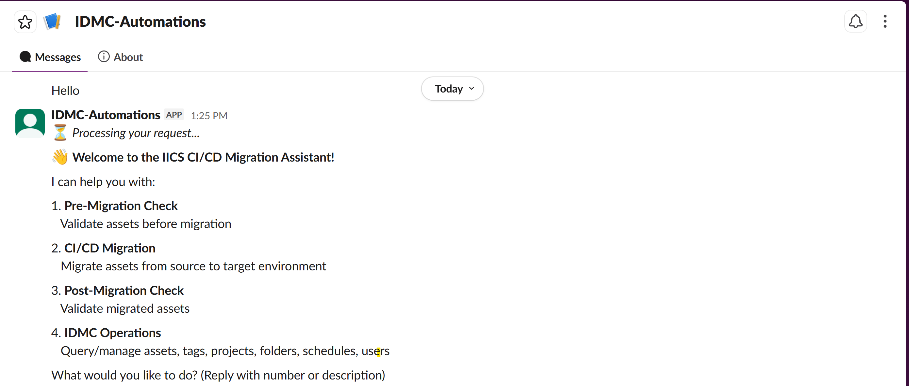
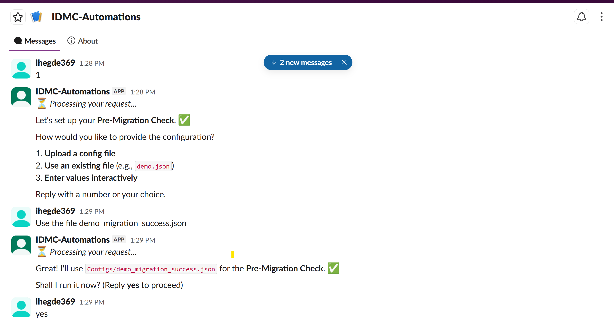
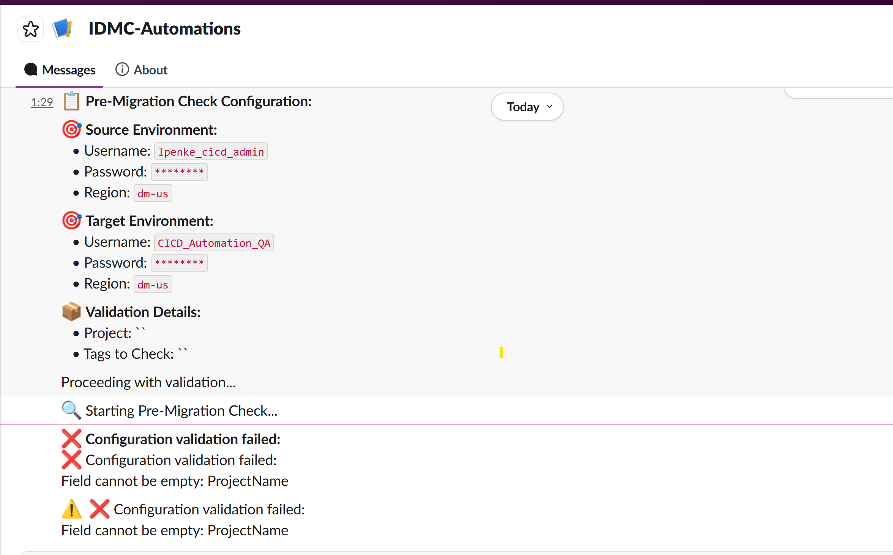
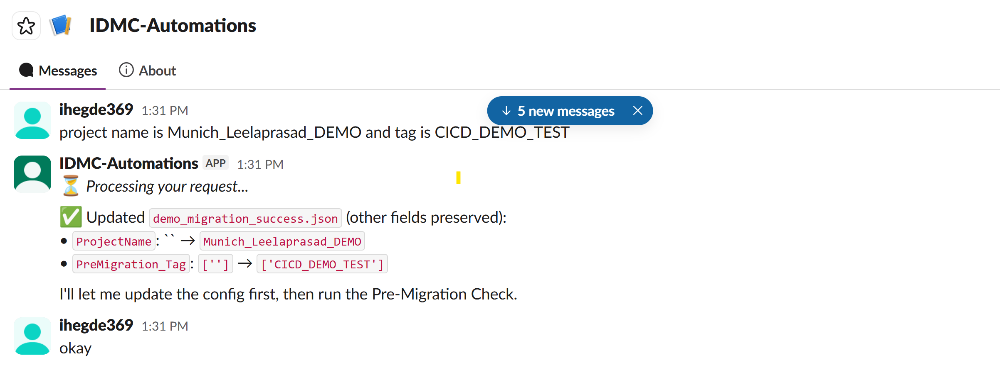
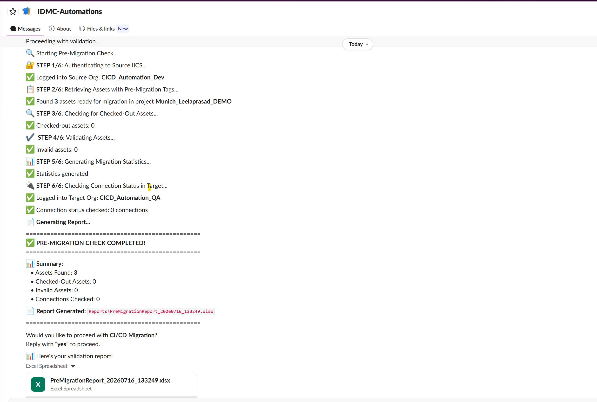
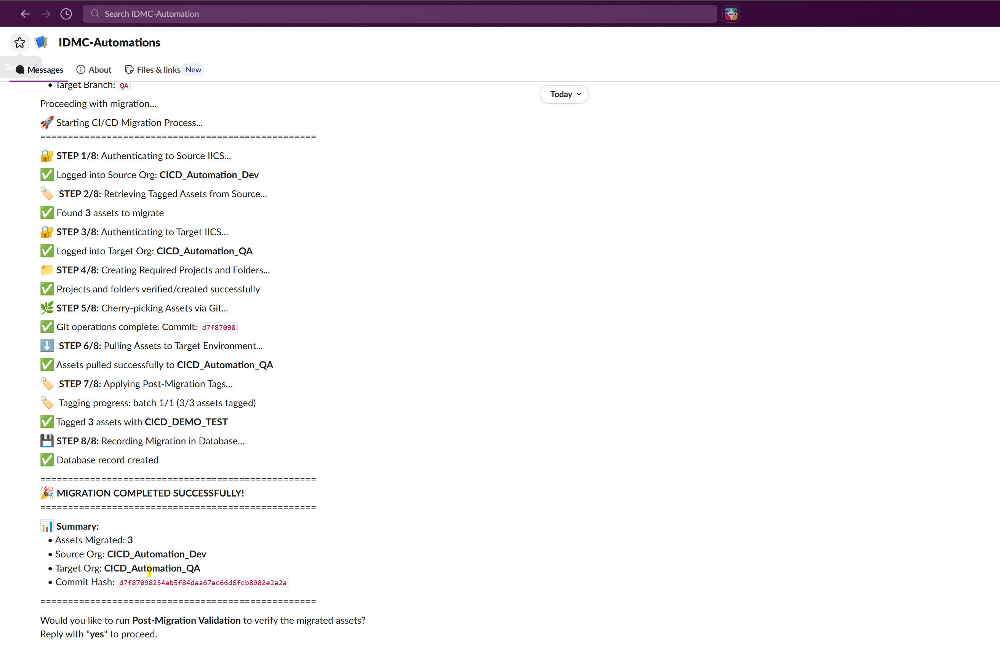
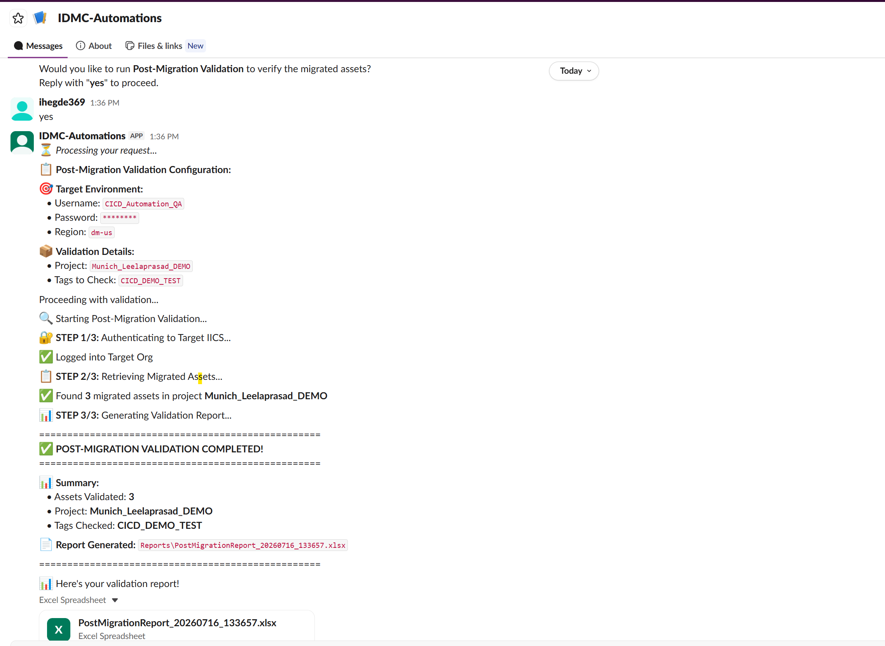

# IICS CI/CD-AI Assistant — User Manual

A practical, day-to-day guide for **using** the IICS CI/CD Migration Assistant from Slack.

> This manual is for end users (migration engineers, admins) who chat with the bot.
> If you are installing or configuring the bot for the first time, see **[SETUP_GUIDE.md](SETUP_GUIDE.md)**.
> For a technical/architecture overview, see **[README.md](README.md)**.

---

## Table of Contents

1. [What the Assistant Does](#1-what-the-assistant-does)
2. [Getting Started](#2-getting-started)
3. [Providing Configuration](#3-providing-configuration)
4. [Operation 1 — Pre-Migration Check](#4-operation-1--pre-migration-check)
5. [Operation 2 — CI/CD Migration](#5-operation-2--cicd-migration)
6. [Operation 3 — Post-Migration Check](#6-operation-3--post-migration-check)
7. [Operation 4 — IDMC Operations](#7-operation-4--idmc-operations)
8. [Reading Reports & Logs](#8-reading-reports--logs)
9. [Tips for Talking to the Bot](#9-tips-for-talking-to-the-bot)
10. [Troubleshooting](#10-troubleshooting)
11. [Quick Reference Card](#11-quick-reference-card)

---

## 1. What the Assistant Does

The assistant is a conversational Slack bot (powered by Claude Opus 4.8) that runs four kinds of IICS/IDMC operations for you:

| # | Operation | What it does |
|---|-----------|--------------|
| 1 | **Pre-Migration Check** | Validates that tagged assets and their connections exist before you migrate. Produces an Excel report. |
| 2 | **CI/CD Migration** | Runs the full 8-step, Git-based migration of tagged assets from a source org to a target org. |
| 3 | **Post-Migration Check** | Confirms the migrated assets and tags landed correctly in the target. Produces an Excel report. |
| 4 | **IDMC Operations** | Answers questions and performs actions on IDMC assets — list/count, tag/untag, create projects & folders, view agents, users, schedules, permissions, and more (35+ functions). |

**The normal end-to-end flow:**

```
Pre-Migration Check  →  CI/CD Migration (8 steps)  →  Post-Migration Check
```

The bot will offer to move you to the next stage after each one succeeds.

---

## 2. Getting Started

### Start a conversation

In Slack, message the bot (or mention it in a channel it's in) with any of:

```
hi
hello
help
```

You'll get the **Welcome Menu**:

```
👋 Welcome to the IICS CI/CD Migration Assistant!

I can help you with:
1. Pre-Migration Check   – Validate assets before migration
2. CI/CD Migration       – Migrate assets from source to target
3. Post-Migration Check  – Validate migrated assets
4. IDMC Operations       – Query/manage assets, tags, projects, folders, schedules, users

What would you like to do? (Reply with a number or a description)
```



You can reply with a **number** (`1`), a **short phrase** (`run pre-migration`), or jump straight to a full request (`how many mappings have tag Production?`).

### Sessions are per-channel

The bot remembers context **within your current Slack channel/conversation** — the project name, usernames, regions, tags, and the config file you're using. It will reuse those when you say things like *"the same project"* or *"that tag"*. It will **not** carry values across different operations without confirming.

---

## 3. Providing Configuration

Every migration operation needs configuration (credentials, tags, project, Git info). You can supply it in **three ways** — pick whichever is easiest.

### Option A — Upload a config file (recommended)

Drag a config file into the Slack chat. Supported formats: **JSON, YAML, TXT, CSV, INI**.

```
You: [uploads dev_to_qa.json]

Bot: ✅ Configuration file saved: dev_to_qa.json
     What would you like to do?
     1️⃣ Run pre-migration check
     2️⃣ Run CI/CD migration
     3️⃣ Run post-migration validation
     4️⃣ Just keep it for later
```

The bot parses the file, maps the fields, and — if anything required is missing — asks you for **only** the missing values.

### Option B — Reference a file already in `Configs/`

If the file already lives in the project's `Configs/` folder, just name it:

```
You: Run migration with config dev_to_qa.json
```

After you pick an operation, the bot asks how you want to supply config and — if you name an existing file — confirms it before running:



### Option C — Enter values in chat (interactive)

Just start describing what you want. The bot asks for missing fields **one at a time**, never guesses, and confirms everything before it runs.

```
You: I want to migrate from dev to qa
Bot: What is the source username (IICS_SRC_username)?
You: dev@example.com
Bot: What is the source region?
...
```

If a required value is missing, the operation stops with a clear message — for example, an empty `ProjectName`:



Just supply the missing values in plain language. The bot updates the config (preserving everything else) and continues:



### Required fields by operation

| Operation | Required fields |
|-----------|-----------------|
| **Pre-Migration** | `ProjectName`, `IICS_SRC_*`, `IICS_TGT_*`, `PreMigration_Tag` |
| **CI/CD Migration** | All Pre-Migration fields **+** `Git_*`, `PostMigration_Tag`, `Publish` |
| **Post-Migration** | `ProjectName`, `IICS_TGT_*`, `PostMigration_Tag` |

### Example config file (CI/CD Migration)

```json
{
  "ProjectName": "MyProject",

  "IICS_SRC_username": "dev@example.com",
  "IICS_SRC_password": "password",
  "IICS_SRC_region": "dm-us",

  "IICS_TGT_username": "qa@example.com",
  "IICS_TGT_password": "password",
  "IICS_TGT_region": "dm-us",

  "PreMigration_Tag": ["ReadyToMigrate"],
  "PostMigration_Tag": ["Migrated"],

  "Git_Repository_URL": "https://github.com/your-org/your-repo.git",
  "Git_config_useremail": "user@example.com",
  "Git_config_username": "Your Name",
  "Git_password": "your_git_token",
  "Git_SRC_Branch": "dev",
  "Git_TGT_Branch": "qa",

  "Publish": 0,
  "logFileDir": "Logs"
}
```

> **Regions:** `dm-us` (US), `dm-eu` (Europe), `dm-ap` (Asia Pacific), `dm-em1` (EMEA).
> **Security:** Never commit config files or `.env` with real credentials. Use a Git token with minimal permissions and rotate credentials regularly.

---

## 4. Operation 1 — Pre-Migration Check

**Purpose:** Confirm the assets you intend to migrate exist and their connections are available in the target — *before* you migrate anything.

**How to run:**

```
You: Run pre-migration check with config dev_to_qa.json
```

**What you'll see:**

```
Bot: 🔍 Starting Pre-Migration Check...
     ✅ Logged into Source Org
     📊 Found 150 assets with tags: ["ReadyToMigrate"]
     ✅ All connections available in target
     📄 Report generated: pre_migration_20260716.xlsx

     Would you like to proceed with migration? (yes/no)
```

The bot streams each step live and finishes with a summary and the generated Excel report:



Reply **`yes`** to continue straight into the migration using the same config, or **`no`** to stop and review the report.

---

## 5. Operation 2 — CI/CD Migration

**Purpose:** Migrate all assets carrying the pre-migration tag from the source org to the target org, using Git as the transport, then apply post-migration tags.

**How to run:**

```
You: Run migration with config dev_to_qa.json
```
or simply `yes` after a successful pre-migration check.

**The 8 steps (shown live in Slack):**

```
Step 1/8: 🔐 Authenticate to Source IICS
Step 2/8: 🏷️  Retrieve Tagged Assets
Step 3/8: 🔐 Authenticate to Target IICS
Step 4/8: 📁 Create Projects and Folders
Step 5/8: 🌿 Cherry-pick Assets via Git
Step 6/8: ⬇️  Pull Assets to Target
Step 7/8: 🏷️  Apply Post-Migration Tags
Step 8/8: 💾 Record in Database (optional)
```

**On success:**

```
🎉 MIGRATION COMPLETED!
 • 150 assets migrated
 • Dev → QA
 • Commit: abc12345

Would you like to run post-migration validation? (yes/no)
```

The full 8-step run, ending with the success summary and commit hash, looks like this in Slack:



**Good to know:**
- **PROJECT** and **FOLDER** types cannot be tagged in IICS. The bot automatically skips them when tagging and tells you how many it skipped.
- API and Git operations retry automatically up to **3 times** with exponential backoff (1s, 2s, 4s).
- If a step fails, the bot reports the exact error — it will **not** claim success.

---

## 6. Operation 3 — Post-Migration Check

**Purpose:** Verify the migrated assets and their tags actually exist in the target org.

**How to run:**

```
You: Run post-migration validation
```
or `yes` after a successful migration.

**What you'll see:**

```
Bot: 🔧 Starting Post-Migration Validation...
     ✅ All 150 assets found in target
     ✅ All tags applied correctly
     📄 Report: post_migration_20260716.xlsx

     ✅ Migration validated successfully!
```

The validation runs in 3 steps and produces its own report:



---

## 7. Operation 4 — IDMC Operations

**Purpose:** Query and manage IDMC assets in plain language — no config file needed. Just give credentials (or let the bot use configured ones) and ask.

### Count vs. List

The bot decides automatically based on your wording:

| You say… | Behavior |
|----------|----------|
| **how many**, count, total, number of | Returns just a **count** (no report) |
| **list**, show, get, display, report | Returns the **full list** + an **Excel report** |

### Common requests

**Querying:**
```
How many mappings are in the Production folder?
List all mapping tasks with tag "Release_v2"
Show me all connections
Show all secure agents
Show all enabled schedules
Show all users in the organization
Show permissions for mapping "Customer_Load"
```

**Managing:**
```
Tag asset abc123 with "Validated"
Tag all mappings with "Release_v2.0"
Remove tag "Old" from asset def456
Create project "DataMigration"
Create folder "Mappings" in project "DataMigration"
Delete project "Obsolete"          (must be empty)
```

**Follow-ups use memory** — after a query you can say:
```
List them all                 → lists the items just counted
Now list connections with that tag
Tag it with "Reviewed"        → uses the last asset ID
```

### What IDMC Operations covers (35+ functions)

- **Assets:** query by type/path, checkout, checkin, undo checkout, operation status
- **Tags:** add / remove
- **Projects & Folders:** create / update / delete
- **Schedules:** list / create / update / delete
- **Agents:** list secure agents, status, runtime environments
- **Users:** list / create / delete
- **Permissions:** view / grant / update / revoke
- **Metering:** export / status / download usage data

> **Asset type note:** IDMC uses backend type codes — e.g. `DTEMPLATE` = Mapping, `MTT` = Mapping Task, `TASKFLOW` = Taskflow, `CONNECTION` = Connection. You can speak naturally ("mappings") and the bot maps it; if a query is ambiguous, it will ask.

---

## 8. Reading Reports & Logs

### Excel Reports → `Reports/`

Generated for pre-migration, post-migration, and IDMC **list** queries. Filenames are date-stamped, e.g. `pre_migration_20260716.xlsx`. When a report is produced, the bot uploads the file directly into Slack.

### Logs → `Logs/`

| File | Covers |
|------|--------|
| `CICDMigration.log` | Migration operations |
| `PreMigrationCheck.log` | Pre-migration validation |
| `PostMigrationCheck.log` | Post-migration validation |
| `IDMCFunctionalities.log` | IDMC API operations |

Log line format:
```
2026-07-16 10:39:06 - MODULE - INFO - [function:line] - Message
```

> ⚠️ Logs may contain sensitive info — review before sharing.

---

## 9. Tips for Talking to the Bot

- **Be direct.** "Run migration with config dev_to_qa.json" works better than a long story.
- **One config, one operation at a time.** Upload/name the file, then pick the operation.
- **Use `yes` / `no`** to accept the bot's next-step suggestions (pre → migrate → post).
- **Confirm before it runs.** For interactive configs, the bot repeats the values back — check them before saying yes.
- **Reuse with "that" / "same" / "it."** The bot remembers the last tag, project, and asset ID within the conversation.
- **It won't guess.** If it's missing a required value, it asks. If you didn't give a password, it won't invent one.
- **It only does these four operations.** Requests like "deploy to a server", "run a SQL query", or "back up the database" are politely declined — those aren't supported.

---

## 10. Troubleshooting

| Symptom | Likely cause | What to do |
|---------|--------------|------------|
| **Bot doesn't respond** | Slack tokens or Socket Mode misconfigured, or bot not running | Confirm the bot process is running; check `SLACK_BOT_TOKEN` / `SLACK_APP_TOKEN` (see SETUP_GUIDE). |
| **"No assets found"** | Wrong tag, or nothing tagged yet | Run a pre-migration check first; verify the `PreMigration_Tag` value matches what's tagged in the source. |
| **Authentication failed** | Bad credentials or wrong region | Verify username/password and the region code (`dm-us`, `dm-eu`, `dm-ap`, `dm-em1`). |
| **Git operation failed** | Bad repo URL or token | Check `Git_Repository_URL` and that `Git_password` (token) is valid and has repo access. |
| **"Skipped X PROJECT/FOLDER assets"** | Normal — those types can't be tagged | No action needed; this is expected behavior. |
| **Permission denied (IDMC)** | User lacks required role | Ask an IDMC admin to grant the needed permissions, or use a user with the right roles. |
| **Operation partially failed** | Transient API/network issue | The bot retries 3× automatically; if it still fails, check the relevant log in `Logs/` and retry. |

**Where to look when something goes wrong:**
1. The bot's message in Slack — it reports the exact failing step and error.
2. The matching log file in `Logs/`.
3. `SETUP_GUIDE.md` → Troubleshooting, for environment/setup issues.
4. Your IICS/IDMC administrator, for access or permission problems.

---

## 11. Quick Reference Card

```
── Start ──────────────────────────────────────────────
hi | hello | help                     → Welcome menu

── Provide config ─────────────────────────────────────
[upload file.json]                    → Bot saves & asks operation
"...with config dev_to_qa.json"       → Use file from Configs/
"I want to migrate from dev to qa"    → Interactive, asks for missing fields

── Pre-Migration ──────────────────────────────────────
run pre-migration check with config dev_to_qa.json
pre-migration check

── CI/CD Migration ────────────────────────────────────
run migration with config dev_to_qa.json
migrate with config file demo.json
yes                                   → after a successful pre-check

── Post-Migration ─────────────────────────────────────
run post-migration validation
validate migration
yes                                   → after a successful migration

── IDMC Operations ────────────────────────────────────
how many mappings?                    → count only
list all assets with tag Production   → full list + Excel report
show me all connections
show all secure agents
tag asset abc123 with Release_v2
create project DataMigration
list them all                         → follow-up on last count
```

---

*For installation and environment setup, see **[SETUP_GUIDE.md](SETUP_GUIDE.md)**. For architecture and developer details, see **[README.md](README.md)** and the module READMEs under `CICDMigration/`, `PreMigrationCheck/`, `PostMigrationCheck/`, and `IDMCFunctionalities/`.*
